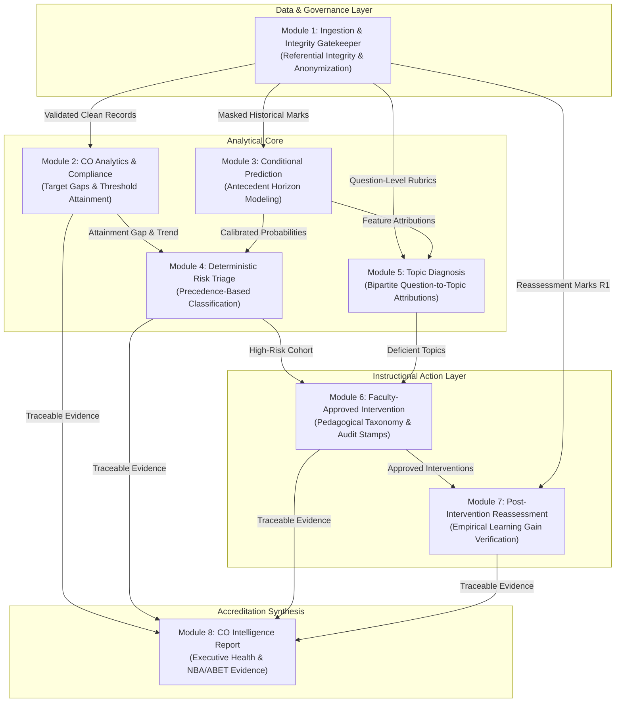

# AI-Powered Course Outcome Early-Warning, Explainability and Instructional Intervention System

> **A closed-loop academic intelligence system that moves from Course Outcome risk prediction to explainable diagnosis, faculty-approved intervention, reassessment, and observed learning-gain analysis.**

[](https://www.typescriptlang.org/)
[](tests/)
[](dist/)
[](docs/ARCHITECTURE.md)

---

## 1. Problem Statement

In higher education and Outcome-Based Education (OBE) frameworks (e.g., NBA and ABET), institutions must track whether students achieve intended **Course Outcomes (COs)**. However, current academic workflows suffer from a fatal structural flaw:

**Course Outcome failure is discovered only after semester-end examinations—when it is too late to intervene.**

Standard Learning Management Systems (Canvas, Blackboard, Moodle) act as passive digital ledgers. They store grades, compute retrospective averages, and generate static bar charts. They do not:
1. Predict impending outcome failures before high-stakes exams.
2. Diagnose *which specific conceptual topics* or question rubrics caused student deficits.
3. Recommend targeted pedagogical interventions tailored to diagnosed weaknesses.
4. Track or empirically verify whether remedial instruction produced actual learning gains.

---

## 2. Proposed Solution: The 8-Module Closed Loop

This system transforms academic outcome management from a passive recording exercise into an **active, 8-stage pedagogical recovery loop**:

```
[Assessment Data]
       ↓
[Module 1: Data Validation & Integrity Gatekeeper]
       ↓
[Module 2: Course Outcome Analytics & Benchmarking]
       ↓
[Module 3: Conditional AI Prediction Engine]
       ↓
[Module 4: Deterministic Early-Warning Risk Triage]
       ↓
[Module 5: Explainable Topic Diagnosis & Attribution]
       ↓
[Module 6: Faculty-in-the-Loop Instructional Intervention]
       ↓
[Module 7: Post-Intervention Reassessment & Learning Gain]
       ↓
[Module 8: Consolidated CO Intelligence Report]
```

---

## 3. Key Innovation: "Prediction is Not the Endpoint"

Most academic AI research stops at **risk prediction**: an algorithm outputs a probability score or a high-risk label, leaving faculty with no actionable guidance. 

**Our core innovation is the closed-loop architecture:**
- Prediction triggers **root-cause topic diagnosis** (mapping failed exam questions to specific curriculum concepts).
- Diagnosis feeds **evidence-linked pedagogical recommendations** (Peer Learning, Practice Worksheets, Faculty Clinics).
- Faculty retain sovereign authority via **Human-in-the-Loop approval**.
- Approved interventions are subjected to **mandatory post-intervention reassessment ($R1$)**, empirically verifying whether the student achieved measurable learning gains before accreditation reports are generated.

---

## 4. Implemented Module Capabilities

* **Module 1 — Data Ingestion & Gatekeeper:** Validates referential integrity across student records, question rubrics, and target thresholds. Rejects negative/out-of-bound marks ($0 \le \text{marks} \le \text{max}$) and enforces zero PII.
* **Module 2 — CO Analytics & Compliance:** Computes student-level and cohort-level Course Outcome attainment against departmental target thresholds (e.g., 70%). Calculates attainment gaps and historical trends.
* **Module 3 — Conditional Prediction Engine:** Models conditional probability of attaining threshold competency at future assessment horizons ($A3$, $B1$, $B2$) using antecedent marks without future data leakage.
* **Module 4 — Deterministic Risk Triage:** Classifies cohort risk using strict, mutually exclusive institutional precedence rules: `INSUFFICIENT DATA` $\to$ `HIGH RISK` $\to$ `LOW RISK` $\to$ `MEDIUM RISK`.
* **Module 5 — Explainable Topic Diagnosis:** Performs bipartite question-to-topic propagation to identify specific conceptual deficiencies (e.g., Page Replacement Algorithms at 24% mastery) with additive linear feature attributions.
* **Module 6 — Instructional Intervention:** Generates ranked pedagogical tactics linked to diagnosed deficiencies. Enforces human faculty review, dosage customization, and immutable approval/rejection audit logging.
* **Module 7 — Reassessment & Learning Gain:** Evaluates post-intervention reassessment marks ($R1$). Calculates Absolute Learning Gain ($\Delta\text{pp}$) and Hake's Normalized Gain ($g$) with strict pre/post data isolation.
* **Module 8 — CO Intelligence Report:** Consolidates all 7 upstream modules into an audit-ready executive decision-support report featuring an Executive Health Summary, NBA/ABET continuous improvement evidence, and unbroken evidence traceability chains.

---

## 5. AI / ML vs. Deterministic Intelligence

To guarantee institutional trust and accreditation audit compliance, the system explicitly delineates probabilistic inference from deterministic policy rules:

| Category | Component | Technology / Method | Rationale |
|:---|:---|:---|:---|
| **Machine Learning** | Module 3: Conditional Prediction | Regularized Logistic Regression with Sigmoid link & Naive Bayes prior fallback | Calibrated posterior probabilities without parameter overfitting on small academic cohorts. |
| **Explainable AI** | Module 5: Feature Attribution | Exact Additive Linear Attribution ($\phi_j = w_j(x_j - \mathbb{E}[X_j])$) | Bypasses sampling noise and instability of permutation-based SHAP surrogates. |
| **Deterministic Engine** | Modules 1, 2, 4, 7, 8 | Referential validation, attainment calculations, priority triage, learning gain mathematics | Accreditation bodies (NBA/ABET) mandate 100% reproducible, auditable figures. |
| **Faculty-in-the-Loop** | Module 6: Intervention Gatekeeper | Human review, dosage modification, and explicit Approval/Rejection action | AI never unilaterally prescribes or penalizes a student; faculty retain full instructional governance. |

> **Why No Generative LLM?** Generative LLMs hallucinate risk states, invent student marks, exhibit stochastic drift across runs, and introduce severe data privacy risks when transmitting grade records to external cloud APIs.

---

## 6. Technology Stack

Extracted directly from project dependencies:

* **Frontend Framework:** React 18.3.1
* **Language & Typing:** TypeScript 5.6.3 (Strict Type Checking)
* **Build System & Dev Server:** Vite 6.0.1
* **Styling & Design System:** Tailwind CSS 3.4.16 with Autoprefixer 10.4.20 and PostCSS 8.4.49
* **UI Utilities:** `clsx` 2.1.1, `tailwind-merge` 2.5.5
* **Iconography:** Lucide React 0.468.0
* **Automated Test Harness:** Node.js CommonJS Regression Suites (`tests/`)

---

## 7. Datasets & Demonstration Data

* **Cohort Dataset:** Anonymized 150-student synthetic engineering cohort (`CS301` Operating Systems, 5 Course Outcomes, 9,320 assessment records).
* **Anonymization & Zero PII:** Student identifiers adhere strictly to the regex `^S\d{3}$` (`S001` through `S150`). All real names, national IDs, and email addresses are discarded.
* **Demonstration Reassessment:** Post-intervention reassessment records ($R1$ cycle, dated `2026-09-15`) located in `data/sample_reassessment.csv`. Distinctly watermarked in the UI as **"SYNTHETIC DEMONSTRATION DATA"**.

---

## 8. Installation & Setup

### Prerequisites
* Node.js (v18.0.0 or higher recommended)
* npm (v9.0.0 or higher)

### Step 1: Clone or Open the Repository
```bash
git clone <repository-url>
cd "AI Course Outcome"
```

### Step 2: Install Dependencies
```bash
npm install
```

### Step 3: Run Development Server
```bash
npm run dev
```
The application will launch locally at `http://localhost:5173`.

### 8.1 Google Gemini AI Recommendation Setup (Optional)

To enable live Google Gemini AI-assisted instructional recommendations in Module 6:

1. Create a Google Gemini API key from [Google AI Studio](https://aistudio.google.com/).
2. Create a local `.env` file in the root directory (copied from `.env.example`).
3. Add your configuration:
   ```bash
   VITE_GEMINI_API_KEY=YOUR_KEY_HERE
   VITE_GEMINI_MODEL=gemini-2.5-flash
   ```
4. Restart the Vite development server (`npm run dev`).

> **Academic Integrity Notice:**  
> Gemini is used only for evidence-grounded instructional recommendation generation. Academic metrics, risk classification, prediction probabilities, target calculations, and learning-gain calculations remain deterministic and are not generated by Gemini.

> **Prototype Security Note:**  
> In Vite, variables prefixed with `VITE_*` are bundled into the client-side JavaScript bundle. This configuration is intended **strictly for local evaluation, hackathon judging, and prototype demonstration**. For production university deployments, recommendations should be requested through a backend/serverless proxy where the API key remains secret on the server.

---

## 9. Production Build & Verification

To verify full TypeScript compilation and create the production bundle:

```bash
# Run TypeScript compilation check
npx tsc --noEmit

# Build production bundle
npm run build
# (Runs tsc && vite build -> outputs to dist/)
```

---

## 10. Automated Testing

The repository contains 9 automated test suites verifying all 8 modules and the Google Gemini AI recommendation layer independently:

```bash
# Run all regression test suites
node tests/testValidation.cjs
node tests/testModule2Analytics.cjs
node tests/testModule3Prediction.cjs
node tests/testModule4Risk.cjs
node tests/testModule5Explainability.cjs
node tests/testModule6Intervention.cjs
node tests/testModule7Reassessment.cjs
node tests/testModule8Report.cjs
node tests/testGeminiRecommendation.cjs
```
**Current Status:** **299 / 299 Tests Passing (100% Pass Rate)**

---

## 11. System Architecture



---

## 12. Privacy, Security & FERPA Compliance

* **Client-Side Pseudonymization:** Student identifiers are stripped at ingestion and mapped to synthetic IDs (`S001`–`S150`).
* **Zero External Data Transmission:** All computation, feature extraction, and reporting execute 100% locally in-browser or on-premise. No student marks or exam questions are transmitted to third-party generative APIs.
* **Audit Trail Immutability:** Faculty intervention approvals record timestamps, user IDs, and rationale for institutional auditability.

---

## 13. Academic Integrity & Methodological Rigor

1. **No Fabricated Metrics:** When reassessment records are pending, metrics display `"Pending"` or `null`; they are **never silently converted to 0.0%**.
2. **Missing Benchmark Handling:** When an institutional CO target is unconfigured, the system explicitly displays `"Target reference unavailable"`.
3. **Strict Anti-Data-Leakage:** Chronological horizon barriers mask subsequent assessments. The target assessment mark is never evaluated in its own prediction feature vector.
4. **No Unwarranted Causal Claims:** Reassessment metrics are phrased strictly as observational performance comparisons (*"Observed attainment increased by 15.0 percentage points"*), avoiding unscientific causal assertions (*"The intervention caused 15% improvement"*).

---

## 14. Limitations

* **Synthetic Demonstration Data:** Currently demonstrated on a validated synthetic cohort (`CS301` Operating Systems, 150 students).
* **Course Structure Optimization:** Designed for continuous-assessment semester courses (quizzes, assignments, midterms).
* **Storage Persistence:** Prototype state persists in browser memory / localStorage rather than a distributed SQL database.

---

## 15. Future Scope

* **LTI 1.3 Enterprise LMS Integration:** Direct single-sign-on and grade synchronization with Canvas, Blackboard, and Moodle.
* **Multi-Semester Prerequisite DAGs:** Graph neural network extensions mapping foundational Course Outcomes across 4-year degree programs.
* **Institutional Historical Calibration:** Automated retraining pipeline tuning logistic regression weights against multi-year institutional cohorts.

