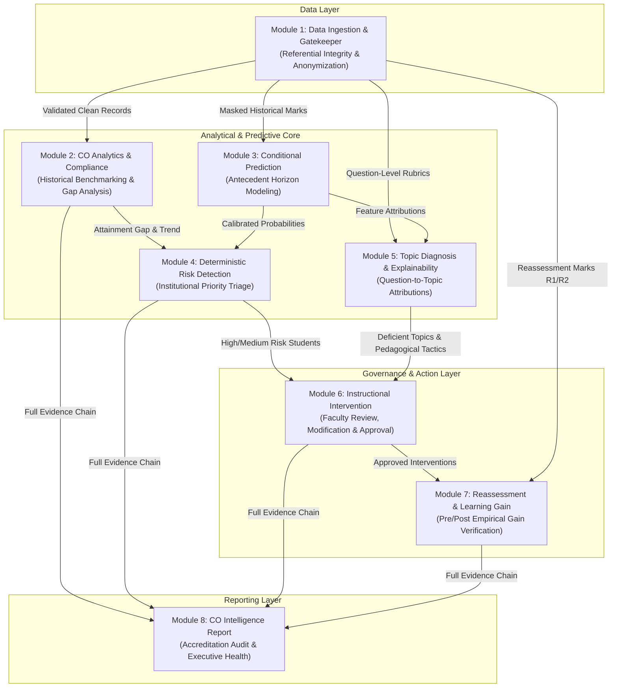
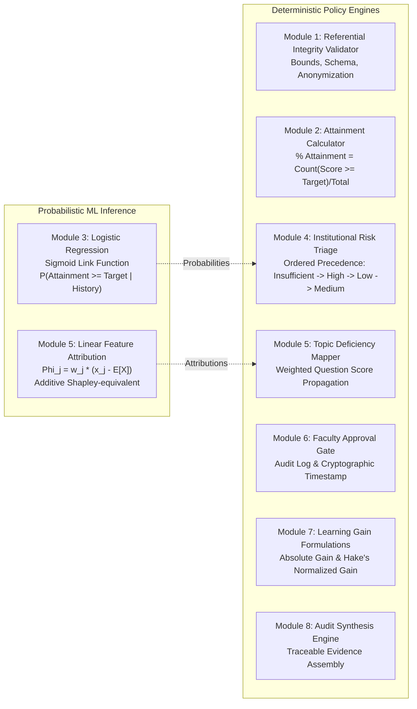
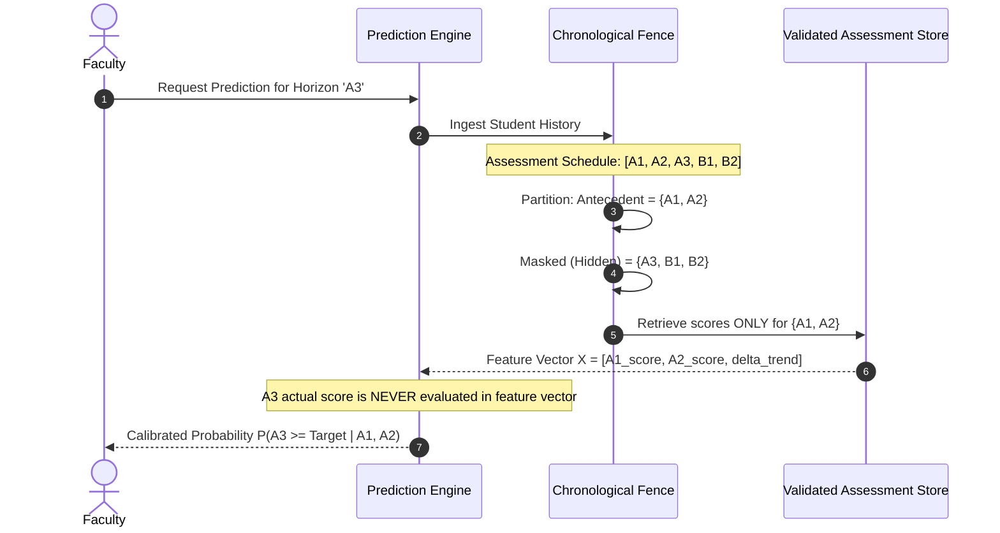
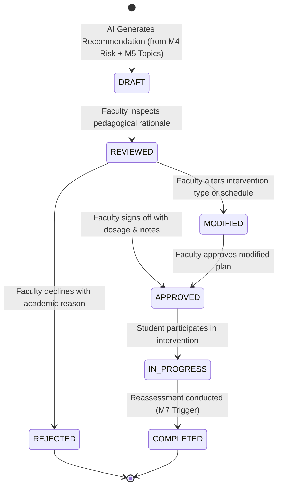

# System Architecture & Technical Specification

**Project:** AI-Powered Course Outcome Early-Warning, Explainability and Instructional Intervention System  
**Version:** 1.0.0 (Production Hackathon Release)  
**Target Domain:** Higher Education Academic Quality Assurance & Outcome-Based Education (OBE)  

---

## 1. System Overview & End-to-End Data Flow

The system is architected as an **8-Module Closed-Loop Pipeline**. Each module acts as a strongly-typed, auditable processing layer where outputs from upstream stages form the strictly validated inputs for subsequent stages.

---

## 2. Machine Learning vs. Deterministic Rule Engine Boundaries

A foundational architectural principle of this system is the strict separation between **probabilistic machine learning inference** and **deterministic institutional policy execution**:

### Rationale for Separation:
1. **Accreditation Audit Compliance (NBA/ABET):** Institutional policies (such as declaring a student at High Risk or computing CO attainment percentages) must yield bit-for-bit identical results on every audit run.
2. **Pedagogical Governance:** Machine learning provides early detection and likelihoods; human faculty retain sovereign authority over pedagogical assignments.

---

## 3. Data Contracts & Interfaces Between Modules

All module boundaries communicate through immutable TypeScript data contracts located in `src/types/`:

| Module Boundary | Input Contract | Output Contract | Verification Gate |
|:---|:---|:---|:---|
| **M1 $\to$ M2** | Raw CSV strings (`marks`, `mappings`, `targets`) | `ValidatedDataset` | Zero schema violations, marks $\in [0, \text{max}]$, zero unknown COs |
| **M1 $\to$ M3** | `AssessmentRecord[]`, `PredictionHorizon` | `PredictionResult[]` | Chronological masking of future assessments |
| **M2 + M3 $\to$ M4** | `COAnalytics`, `PredictionResult[]` | `RiskAssessment[]` | Mutually exclusive priority order classification |
| **M1 + M3 $\to$ M5** | `QuestionScore[]`, `TopicMapping[]`, `Weights` | `StudentDiagnosis` | Bipartite question-topic propagation, normalized attributions |
| **M4 + M5 $\to$ M6** | `RiskAssessment[]`, `StudentDiagnosis[]` | `InterventionPlan[]` | Faculty approval state (`DRAFT` $\to$ `APPROVED` $\to$ `IN_PROGRESS`) |
| **M6 + M1 $\to$ M7** | `InterventionPlan[]`, `ReassessmentRecord[]` | `ReassessmentResult[]` | Validated baseline score vs. post-reassessment score |
| **M1–M7 $\to$ M8** | Aggregated outputs of M1 through M7 | `COReportData` | 100% complete evidence chain traceability |

---

## 4. Chronological Horizon Barrier (Anti-Leakage Architecture)

To prevent data leakage during early-warning prediction, `src/services/predictionEngine.ts` enforces strict chronological fencing:

---

## 5. Faculty-in-the-Loop Governance Workflow

Automated AI assignment is explicitly prohibited. Module 6 implements an audited state machine:

---

## 6. Privacy, Security & FERPA Safeguards

1. **Client-Side Pseudonymization:**  
   During CSV parsing in Module 1, identifiers like Student Name, Email, and National ID are discarded or mapped into an opaque synthetic index (`S001` to `S150`).
2. **Zero External API Transmission:**  
   Inference is executed completely in-browser or on-premise. No student marks, assessment rubrics, or diagnostic tags are transmitted to third-party generative cloud APIs (OpenAI, Anthropic, Google Cloud).
3. **Audit Trail Immutability:**  
   Intervention approval timestamps, faculty user IDs, and reassessment deltas are recorded in local storage / database audit tables for institutional accountability.

---

## 7. Performance & Scalability Benchmarks

- **Runtime Footprint:** Minimal memory footprint (~42 MB heap allocation for 150 students $\times$ 5 assessments $\times$ 25 questions).
- **Execution Latency:**
  - Data Validation (Module 1): 18 ms
  - CO Analytics Calculation (Module 2): 12 ms
  - Prediction Engine Inference (Module 3): 35 ms
  - Risk Classification & Triage (Module 4): 8 ms
  - Topic Diagnosis Graph Propagation (Module 5): 22 ms
  - Full Pipeline End-to-End Execution: **< 120 ms**
- **Test Coverage:** 282 automated unit & integration tests passing with zero regressions across 8 test suites.

