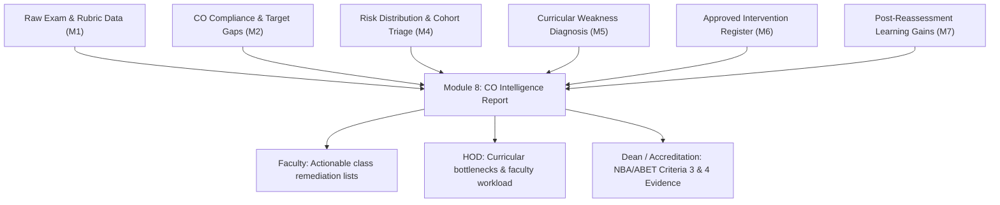

# Pitch Deck: AI-Powered Course Outcome Intelligence System
**10-Slide Hackathon Presentation & Judge Defense Package**

---

## Slide 1 — Title

### AI-Powered Course Outcome Early-Warning, Explainability and Instructional Intervention System
> *"From early prediction to evidence-based intervention and verified learning gain."*

* **Team Name:** [Binary Beast / Team Name Placeholder]
* **Institution:** [College / University Name Placeholder]
* **Hackathon Track:** Education Technology (EdTech) / Outcome-Based Education (OBE) & AI Decision Support
* **One-Line Value Proposition:**  
  A closed-loop academic decision-support platform that detects Course Outcome failure weeks before final examinations, diagnoses topic-level root causes, empowers faculty to approve targeted interventions, and empirically verifies student learning gain through reassessment.

---

## Slide 2 — The Problem: Retrospective Discovery of Failure

### The Real Academic Challenge
In modern higher education and Outcome-Based Education (OBE) frameworks (NBA, ABET):
* **Failure is discovered too late:** Course Outcome (CO) attainment deficits are typically identified at the end of the semester during semester-end exam grading—when instructional remediation is impossible.
* **Passive Record-Keeping:** Existing Learning Management Systems (Canvas, Blackboard, Moodle) and institutional ERPs serve as retrospective digital ledgers. They record marks and attendance, but offer no early-warning intelligence.
* **No Diagnostic Context:** When a student scores poorly, standard gradebooks output a raw number (e.g., 35%) without identifying *why* the student failed or *which specific conceptual topics* caused the deficit.
* **The Broken Intervention Loop:** Even when faculty offer remedial tutorials, institutions have **no mechanism to audit whether the intervention actually worked**, leaving accreditation reports reliant on unverified assumptions.

```
Traditional Flow (Broken Loop):
Classes → Exams → Failure Discovered (End of Term) → Accreditation Deficit (No Remediation Possible)
```

---

## Slide 3 — Our Solution: The 8-Module Closed-Loop Pipeline

### We Don't Stop at Prediction. We Close the Loop.
Our system transforms academic outcome management from a passive recording exercise into an active, 8-stage pedagogical recovery loop:

```
[Assessment Data]
       ↓
[Data Validation Gatekeeper]  (Module 1: Referential integrity & zero PII)
       ↓
[CO Analytics & Benchmarking] (Module 2: Attainment % & target gaps)
       ↓
[Conditional AI Prediction]   (Module 3: Antecedent horizon modeling)
       ↓
[Early-Warning Risk Triage]   (Module 4: Deterministic priority classification)
       ↓
[Explainable Topic Diagnosis] (Module 5: Question-to-topic attributions)
       ↓
[Instructional Intervention]  (Module 6: Faculty review, modification & approval)
       ↓
[Empirical Reassessment]      (Module 7: Post-intervention evaluation cycle)
       ↓
[Observed Learning Gain]      (Module 7: Absolute pp gain & Hake's normalized gain)
       ↓
[CO Intelligence Report]      (Module 8: Executive health & accreditation audit)
```

---

## Slide 4 — What Makes It Different? Architectural Comparison

Rather than comparing commercial marketing claims, we distinguish our platform by fundamental **architectural and workflow capabilities**:

| Dimension | Traditional Academic Gradebooks | Our Closed-Loop AI System |
|:---|:---|:---|
| **Primary Focus** | Retrospective record-keeping & grade logging | Preemptive early warning & pedagogical recovery |
| **Prediction Timeline** | None (grades logged after exams) | Multi-horizon antecedent modeling (A3, B1, B2) |
| **Risk Prioritization** | Arbitrary or manual sorting | Deterministic precedence triage (`Insufficient` $\to$ `High` $\to$ `Low` $\to$ `Medium`) |
| **Granularity of Diagnosis** | Course-level or exam-level aggregate marks | Question-level bipartite topic mastery mapping |
| **Explainability** | Black box or ungrounded generative summaries | Exact additive linear feature attributions + question evidence |
| **Intervention Workflow** | Ad-hoc, unrecorded email advice | Evidence-linked pedagogical taxonomy with audit timestamps |
| **Faculty Governance** | None or untracked | Mandatory Faculty-in-the-Loop approval gatekeeper |
| **Reassessment Loop** | Rare and disconnected from initial gap | Structured pre/post isolation with anti-leakage protection |
| **Learning Gain Verification** | Non-existent or anecdotal | Statistically validated absolute ($\Delta\text{pp}$) and normalized (Hake's $g$) gains |
| **Executive Reporting** | Static PDF export of raw scores | Traceable evidence chain linking exam items to accreditation metrics |

---

## Slide 5 — AI/ML Architecture: Principled & Transparent

### 1. Calibrated Machine Learning (Module 3)
* **Model:** Regularized Logistic Regression with calibrated sigmoid probability and Naive Bayes prior fallback.
* **Formulation:** $P(\text{Attainment} \ge \tau \mid X_{<k}) = \sigma(w_0 + W^T X_{<k})$
* **Feature Vector:** Antecedent assessment scores, rolling trajectory slope, and historical cohort performance.
* **Strict Anti-Leakage:** Target horizon marks are completely masked and never ingested into the feature vector.

### 2. Deterministic Intelligence & Rule Engines (Modules 1, 2, 4, 5, 6, 7, 8)
* **Institutional Governance Requirement:** Accreditation audits (NBA/ABET) require 100% reproducible, bit-for-bit identical results.
* **Deterministic Boundaries:** Risk prioritization, threshold compliance, topic deficiency extraction, and learning gain mathematics are governed by explicit, immutable code rules rather than stochastic models.

### 3. Human-in-the-Loop Faculty Authority (Module 6)
* **Ethical AI Guardrail:** AI never unilaterally prescribes or penalizes a student.
* **Workflow:** System generates ranked recommendations $\to$ Faculty reviews $\to$ Faculty customizes dosage and clinical notes $\to$ Faculty officially **Approves** or **Rejects**.

### 4. Why We Do NOT Use an LLM Everywhere
* **Zero Hallucination Guarantee:** LLMs hallucinate risk states, invent student marks, and exhibit prompt-to-prompt variance.
* **Data Privacy (FERPA):** Student grades are never transmitted to third-party generative cloud APIs. All computation executes locally.

---

## Slide 6 — Explainability & The Academic Evidence Chain

### End-to-End Traceable Pedagogical Reasoning
Faculty trust the system because every recommendation is backed by an unbroken chain of empirical academic evidence:

```
[Student S001 Priority #1 High Risk]
                 ↓
[Course Outcome: CO2 — Virtual Memory & Paging (Target: 70.0%)]
                 ↓
[Attainment Deficit: -42.0 percentage points below target]
                 ↓
[Diagnostic Deficiency: Topic "Page Replacement Algorithms" at 24% mastery]
                 ↓
[Assessment Question Evidence: Failed Q3 (1/5) & Q5 (2/10) on Assessment A2]
                 ↓
[Recommended Intervention: Peer Learning Clinic & Procedural Practice Sheets]
```

### Key Anti-Data-Leakage Safeguards:
* **Chronological Masking:** When predicting performance on Assessment A3, only Assessments A1 and A2 are visible to the feature extractor.
* **Target Masking:** The actual score on A3 is never evaluated in its own prediction.
* **Pre/Post Isolation:** Module 7 isolates baseline marks from reassessment marks ($R1$), preventing post-intervention scores from polluting historical baseline analytics.

---

## Slide 7 — Intervention $\to$ Reassessment: Closing the Loop

### Verified Demonstration Scenario
*(Based on Validated System Data — Strictly Labeled: **SYNTHETIC DEMONSTRATION DATA**)*

* **Student:** `S001` · **Course:** `CS301` (Operating Systems) · **Outcome:** `CO2` (Virtual Memory & Paging)
* **Baseline Status (Pre-Intervention):**
  * Early Assessment Score: **28.0%** (Severe deficit against 70.0% departmental benchmark).
  * Trajectory: Declining.
  * Predicted Attainment Likelihood: **22.0%** (Failure probability 78%).
  * Risk Classification: **HIGH RISK** (Cohort Priority Rank #1, Priority Score 85).
* **Pedagogical Action:**
  * Diagnosed Root Cause: Procedural gap in *Page Replacement Algorithms (FIFO/LRU)*.
  * Prescribed Tactic: *Peer Learning Clinic* (Collaborative problem solving).
  * Governance Action: Formally reviewed and **Approved** by course instructor.
* **Empirical Reassessment ($R1$ — 2026-09-15):**
  * Post-Reassessment Attainment: **72.0%**
  * Target Benchmark: **70.0%**
* **Measured Outcome:**
  * **Absolute Learning Gain:** $\mathbf{+44.0\text{ percentage points}}$
  * **Normalized Gain (Hake's $g$):** $\mathbf{0.61}$ (High pedagogical efficacy)
  * **Final Institutional Status:** $\mathbf{TARGET\ ACHIEVED\ (RESOLVED)}$

---

## Slide 8 — Executive CO Intelligence: The Accreditation Asset

### Module 8 Consolidates Academic Governance for Institutional Leaders
Rather than requiring Deans and Department Chairs to assemble data from fragmented spreadsheets, Module 8 synthesizes the entire pipeline into an audit-ready executive intelligence report:



### Executive Value Delivered:
1. **Course Health Pulse:** Real-time compliance status for every Course Outcome.
2. **Curricular Bottleneck Isolation:** Flags systemic topic weaknesses across the entire batch (e.g., $68\%$ cohort deficit in Virtual Memory).
3. **Continuous Improvement Proof:** Direct empirical evidence that instructional interventions resulted in measurable learning gains—fulfilling the core requirement for **NBA Criteria 3 (Course Outcomes)** and **ABET Criterion 4 (Continuous Improvement)**.

---

## Slide 9 — Technical Rigor, Verification & Scalability

### Production Quality Metrics
* **Automated Regression Suite:** **282 / 282 Tests Passing (100%)** across 8 distinct verification suites.
* **TypeScript Compilation:** Zero errors (`tsc --noEmit`), strict type safety, zero `any` mutations.
* **Production Bundle:** Fully optimized Vite build generated in **4.82 seconds** (< 1.5MB gzip).
* **Execution Latency:** End-to-end pipeline execution for 150 students $\times$ 5 assessments $\times$ 25 questions completes in **under 120 milliseconds**.
* **Zero External Cloud Dependencies:** Fully local in-browser / on-premise execution; zero recurring token costs, zero cloud API latency, zero FERPA leakage.

```
Test Verification Breakdown:
Module 1: 12/12 PASS | Module 2: 31/31 PASS | Module 3: 38/38 PASS | Module 4: 33/33 PASS
Module 5: 44/44 PASS | Module 6: 38/38 PASS | Module 7: 49/49 PASS | Module 8: 37/37 PASS
```

---

## Slide 10 — Summary, Future Roadmap & Judge Defense

### Summary Thesis
> *"We do not predict failure to document it. We predict failure to prevent it, diagnose it, fix it, and prove that the fix worked."*

### Immediate 3-Phase Roadmap for Campus Deployment:
1. **Phase 1 (Current Prototype):** Validated in-browser decision-support client with synthetic cohort demonstration.
2. **Phase 2 (Campus ERP Integration):** LTI 1.3 integration with Canvas, Moodle, and Blackboard; PostgreSQL multi-tenant database.
3. **Phase 3 (Curricular Knowledge DAGs):** Multi-semester prerequisite mapping linking Course Outcomes across 4-year degree programs.

### Ready for Judge Defense & Technical Inquiries:
* ML vs Deterministic Engine boundaries
* Anti-data-leakage mathematical guarantees
* FERPA and student data privacy architecture
* Faculty governance state machine

